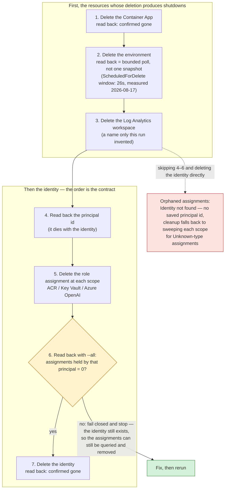

# Container Apps Teardown Order

`delete-container-app.sh` runs seven steps whose order is a contract, not a
convenience, per [container-apps.md §9](../container-apps.md#9-teardown-ordering-is-a-contract-not-a-convenience):
Azure does not delete a managed identity's role assignments when the identity
is deleted, and the principal id — the handle that ties those assignments to
*this* identity — dies with it (what remains afterwards is a per-scope sweep
for `ObjectType: Unknown` assignments, no longer a lookup). So the principal
id is read back before anything identity-related is touched, and a
fail-closed `--all` read-back stands between deleting the assignments and
deleting the identity. Aborting in the middle is worse than failing outright:
it leaves the identity, its three assignments and the workspace all standing.

This English diagram is the semantic companion to the article's published
figure. The publication PNG is rendered from the localized source
[`aca-teardown-order.zh-tw.mmd`](aca-teardown-order.zh-tw.mmd) in this same
directory — both sources are public and canonical here; the planning repo
stores only the rendered PNG snapshot. Changes to either file must keep the
two topologies identical.

Reading notes:

- Step 6 queries **by assignee alone**, with `--all` — the CLI's default is
  subscription scope only, and all three assignments here are at resource
  scope, so without `--all` the read returns `0` no matter what remains.
- The dashed edge is the counterfactual the contract exists to prevent: it is
  not a path the script can take.
