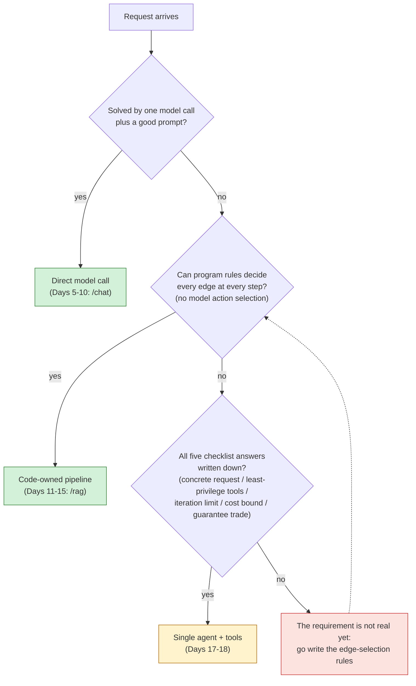

# Agent Decision Flow

The decision procedure from the [Agent Decision Guide](../agent-decision-guide.md), as a flowchart. Deliberately self-referential: every edge in this graph is decided by a program rule — no node asks a model to select an action — which is exactly why this decision is a checklist, not an agent.

This English diagram is the semantic companion to the article's published figure. The publication PNG is rendered from a localized (zh-TW) Mermaid source tracked in the planning repo alongside the article assets; changes here must be mirrored there.

Reading notes:

- The first diamond is the Azure Architecture Center's lowest complexity level (direct model call); the guide cites the instruction to use the lowest level that reliably meets requirements (checked 2026-08).
- The second diamond is the guide's main criterion: edge/action-selection ownership. "Can you draw the flow as a fixed graph?" is deliberately **not** the question — an agent loop is also a fixed cyclic graph (candidate tools, `model → tool → model` edges, iteration limit, all drawable up front). What is dynamic at runtime is who picks the edge.
- The third diamond is the guide's five-item checklist; failing it routes back to writing edge-selection rules, not to an agent.
