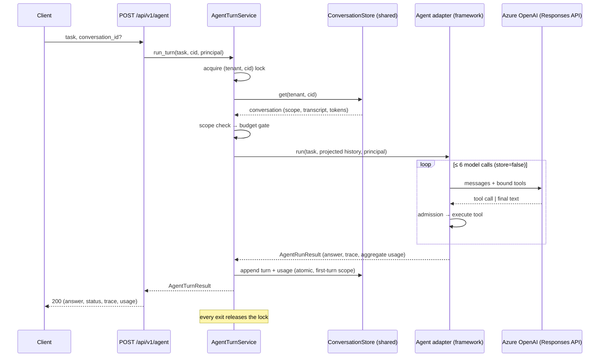

# Agent turn sequence (Day 18)

```mermaid
sequenceDiagram
    participant C as Client
    participant A as POST /api/v1/agent
    participant T as AgentTurnService
    participant S as ConversationStore (shared)
    participant F as Agent adapter (framework)
    participant P as Azure OpenAI (Responses API)

    C->>A: task, conversation_id?
    A->>T: run_turn(task, cid, principal)
    T->>T: acquire (tenant, cid) lock
    T->>S: get(tenant, cid)
    S-->>T: conversation (scope, transcript, tokens)
    T->>T: scope check → budget gate
    T->>F: run(task, projected history, principal)
    loop ≤ 6 model calls (store=false)
        F->>P: messages + bound tools
        P-->>F: tool call | final text
        F->>F: admission → execute tool
    end
    F-->>T: AgentRunResult (answer, trace, aggregate usage)
    T->>S: append turn + usage (atomic, first-turn scope)
    T-->>A: AgentTurnResult
    A-->>C: 200 (answer, status, trace, usage)
    Note over T: every exit releases the lock
```
</content>
