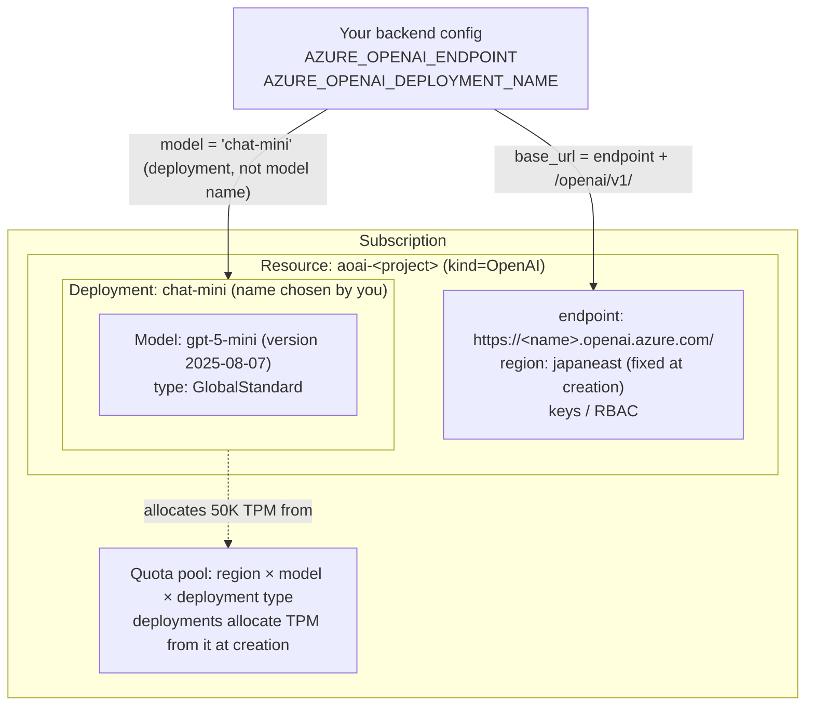

# Azure OpenAI Resource Hierarchy

How the names in your config map to Azure OpenAI's structure (Day 4).
The deployment name is the indirection between application runtime and the
model version: your code points at it, it points at a model.

Solid arrows: what your config points at. Dotted arrow: capacity allocated at
deployment creation (the sum across deployments in the same scope cannot exceed
the pool). The pool belongs to the subscription, not to one resource —
deployments in other resources in the same region/model/type draw from it too.
