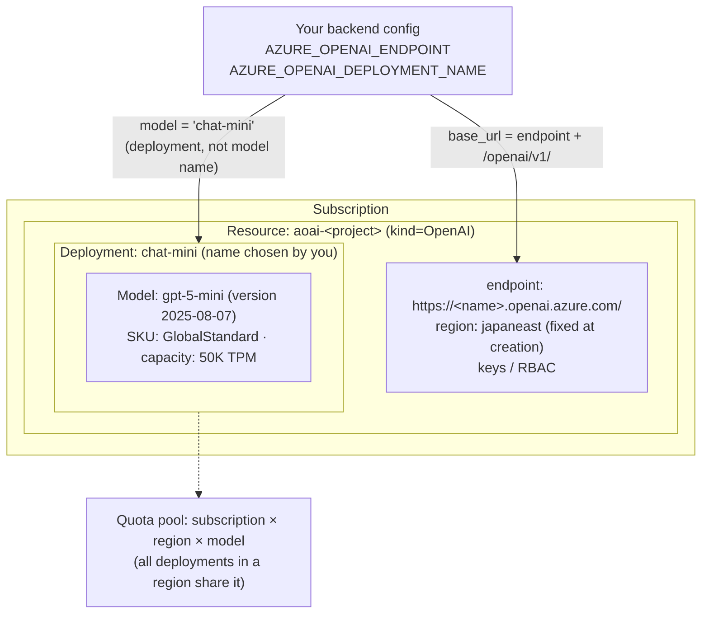

# Azure OpenAI Resource Hierarchy

How the names in your config map to Azure OpenAI's structure (Day 4).
The deployment name is the only indirection you control: your code points at it,
it points at a model version.

Solid arrows: what your config points at. Dotted arrow: where the TPM quota is drawn from.
