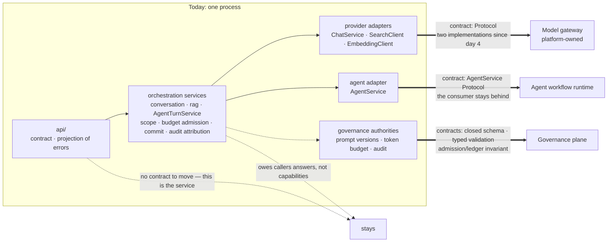

# App to Platform: Which Boundaries Move

Three boundaries could move out of this process, and one thing they have in
common is why: each has a contract that tests exercise. Entries, evidence, and
triggers are in [roadmap.md](../roadmap.md).

Double arrows are moves this repo has evidence for the *starting point* of —
the contract exists and tests exercise it. It has not made any of these moves,
and the world after a move is outside this lab's evidence entirely.

Dotted arrows to "stays" are the other half of the claim: `api/` is the service's
own contract, and the orchestration services own answers the application owes
its callers — conversation scope, budget admission, turn commit, audit
attribution. Neither becomes movable by being wanted elsewhere.
