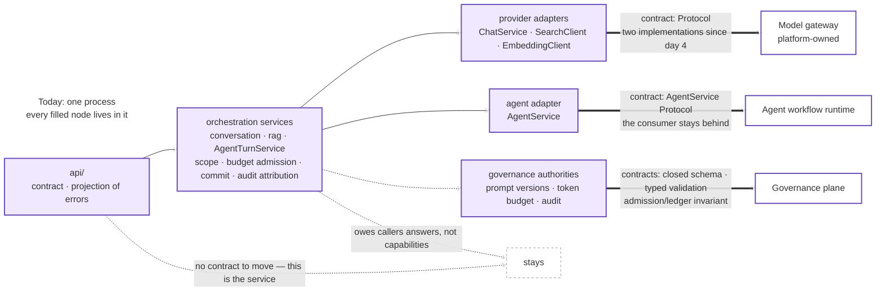

# App to Platform: Which Boundaries Move

Three boundaries could move out of this process, and one thing they have in
common is why: each has a contract that tests exercise. Entries, evidence, and
triggers are in [roadmap.md](../roadmap.md).

Filled nodes are inside today's single process; unfilled ones are where a
boundary would land. There is no container box around the process on purpose:
mermaid clips edges at a cluster border, which hid the source node of every
arrow — and which node moves is the whole claim.

Double arrows are moves this repo has evidence for the *starting point* of —
the contract exists and tests exercise it. That is a prerequisite, not a proof:
it says nothing yet about the network boundary, partial failure, transactions
that no longer share a process, or the operational owner a move introduces. This
repo has not made any of these moves, and the world after one is outside its
evidence entirely.

Dotted arrows to "stays" are the other half of the claim: `api/` is the service's
own contract, and the orchestration services own answers the application owes
its callers — conversation scope, budget admission (conversation and agent
turns; `/rag` has no conversation ledger), turn commit, audit attribution.
Neither becomes movable by being wanted elsewhere.
