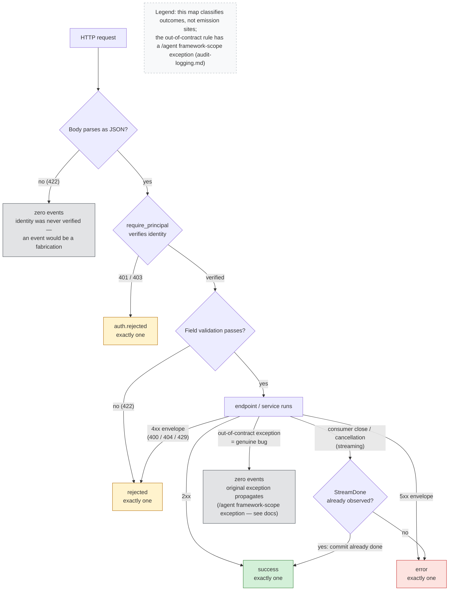

# Audit Event Exit Paths

Every request that reaches a terminal the audit contract classifies lands on exactly one
exit of this map, per the in-process classification in
[audit-logging.md](../audit-logging.md#exactly-once--delivery): an authenticated route
request produces exactly one route event, a rejected authentication produces exactly one
`auth.rejected`, and two exits deliberately produce **zero** events — a malformed-JSON body
(no identity was ever verified, so an event would be a fabrication) and an out-of-contract
exception (a genuine bug must stay loud, not be reclassified as a disconnect or a clean
outcome).

This English diagram is the semantic companion to the article's published figure. The
publication PNG is rendered from the localized source
[`audit-exit-paths.zh-tw.mmd`](audit-exit-paths.zh-tw.mmd) in this same directory — both
sources are public and canonical here; the planning repo stores only the rendered PNG
snapshot. Changes to either file must keep the two topologies identical.

Reading notes:

- The map classifies **outcomes**, not emission sites. The six actual emission points (the
  `/chat` finalizer, `/chat/stream`'s two-phase ownership, `RagService.answer()`'s guarded
  terminals, the `/agent` finalizer, `require_principal`, and the 422 handler) are listed in
  [audit-logging.md](../audit-logging.md#exactly-once--delivery); e.g. the "field validation"
  422 event is emitted by the validation handler, not by the route handler, whose body is
  never entered.
- The cancellation diamond is the commit-truth rule: the store commits **before** the
  terminal frame is yielded, so a cancellation after `StreamDone` was observed keeps the
  terminal outcome — the audit log records commit truth, not delivery truth. The edge says
  "consumer close / cancellation," not "client disconnect": the emitting branch catches both
  `GeneratorExit` and `asyncio.CancelledError`, and a cancellation can originate server-side;
  the event cannot prove which side initiated it.
- Gray exits are deliberate zero-event paths, not gaps: they are the two cases the system
  refuses to classify, for opposite reasons (no verified identity to attribute; a bug that
  must not be laundered into a clean outcome). The out-of-contract rule is exact for
  `/chat`, `/chat/stream`, and `/rag`; `/agent`'s framework adapter wraps in-scope
  exceptions into `AgentRunError`, so for that route it is a route-boundary rule — see
  [audit-logging.md](../audit-logging.md#exactly-once--delivery).
- One streaming case never reaches this map at all: an observer generator closed before its
  first iteration emits nothing (a known, disclosed zero-event window — same doc, "a known
  gap in the delivery chain").
