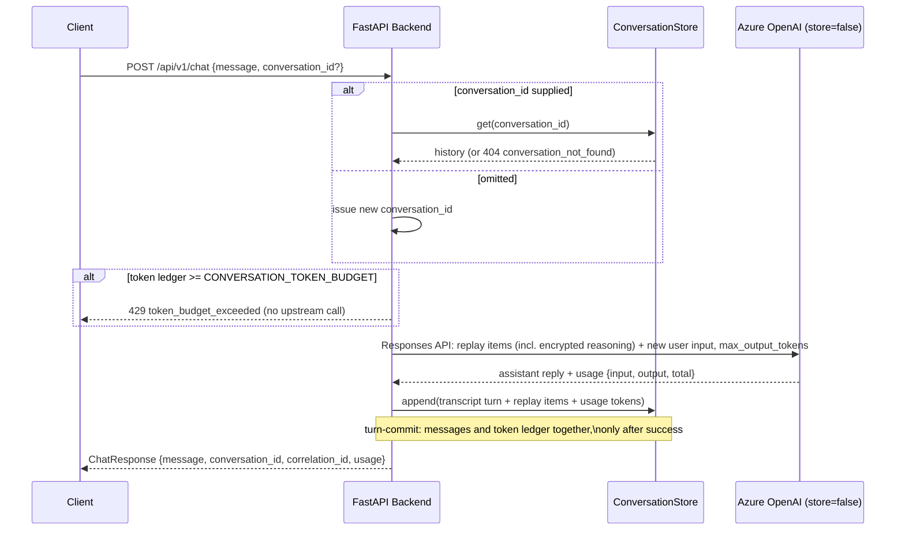

# Chat Sequence

```mermaid
sequenceDiagram
    participant Client
    participant API as FastAPI Backend
    participant Store as ConversationStore
    participant LLM as Azure OpenAI (store=false)

    Client->>API: POST /api/v1/chat {message, conversation_id?}
    alt conversation_id supplied
        API->>Store: get(conversation_id)
        Store-->>API: history (or 404 conversation_not_found)
    else omitted
        API->>API: issue new conversation_id
    end
    alt token ledger >= CONVERSATION_TOKEN_BUDGET
        API-->>Client: 429 token_budget_exceeded (no upstream call)
    end
    API->>LLM: Responses API: replay items (incl. encrypted reasoning) + new user input, max_output_tokens
    LLM-->>API: assistant reply + usage {input, output, total}
    API->>Store: append(transcript turn + replay items + usage tokens)
    Note over API,Store: turn-commit: messages and token ledger together,\nonly after success
    API-->>Client: ChatResponse {message, conversation_id, correlation_id, usage}
```
