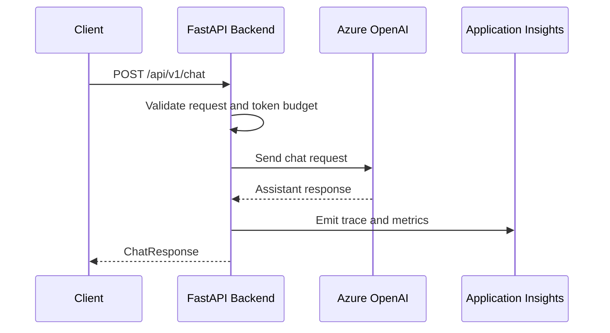

# Chat Sequence

```mermaid
sequenceDiagram
    participant Client
    participant API as FastAPI Backend
    participant LLM as Azure OpenAI
    participant Logs as Application Insights

    Client->>API: POST /api/v1/chat
    API->>API: Validate request and token budget
    API->>LLM: Send chat request
    LLM-->>API: Assistant response
    API->>Logs: Emit trace and metrics
    API-->>Client: ChatResponse
```
