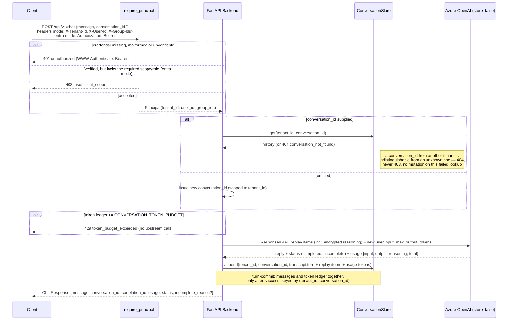

# Chat Sequence

Extended Day 15: every request now resolves a `Principal` before touching `ConversationStore`, and
every store/lock key is `(tenant_id, conversation_id)` rather than a bare `conversation_id`.
Extended Day 19: the same dependency resolves that `Principal` either from trusted gateway headers
or from a verified Microsoft Entra ID access token, chosen once at startup from `AUTH_MODE`. The
JWT internals are not repeated here — see the
[Entra authentication sequence](entra-auth-sequence.md) and
[entra-id-auth.md](../entra-id-auth.md).

`/api/v1/chat/stream` follows the same `require_principal` step before the stream opens: a rejected
credential is a pre-stream JSON 401 or 403 (the Day 6 two-stage error boundary), never an SSE
`error` event, and the tenant/user context stays set for the whole streamed response body.
