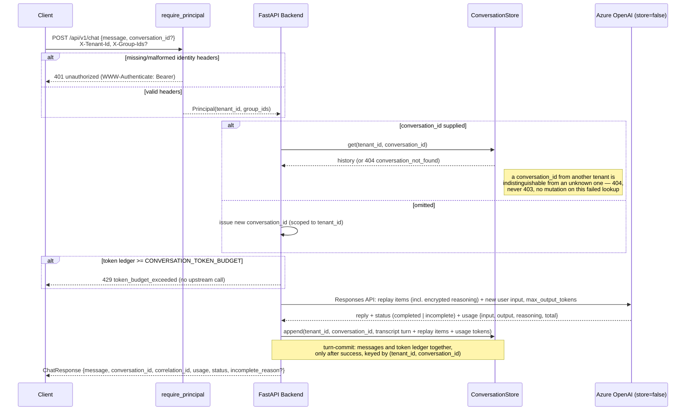

# Chat Sequence

Extended Day 15: every request now resolves a `Principal` before touching `ConversationStore`, and
every store/lock key is `(tenant_id, conversation_id)` rather than a bare `conversation_id`.

`/api/v1/chat/stream` follows the same `require_principal` step before the stream opens: a missing
or malformed principal is a pre-stream JSON 401 (the Day 6 two-stage error boundary), never an SSE
`error` event, and the tenant context stays set for the whole streamed response body.
