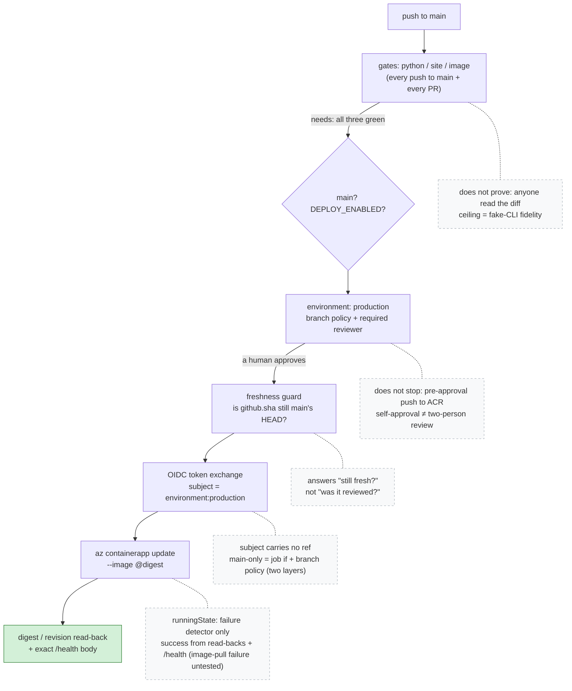

# CI/CD Defense Boundaries

One push to `main`, one deploy, and every control on the way — each annotated
with what it does **not** prove. The main chain is the path a commit actually
travels through [`ci.yml`](../../.github/workflows/ci.yml); the dashed side
notes are each layer's limit, as stated in
[ci-cd.md §4](../ci-cd.md#4-layered-controls-and-each-layers-limit). A layer's
name is always broader than its guarantee: `needs` proves the automated gates
were green, not that anyone read the diff; the approval gate does not stop the
pre-approval image push ([§2](../ci-cd.md#2-two-identities-and-the-residual-approval-does-not-remove));
the deploy identity's OIDC subject carries no ref, so "only `main` deploys"
comes from two separate layers — this workflow's own job-level `if` and the
environment's deployment branch policy, which holds even for a workflow that
omits that condition ([§3](../ci-cd.md#3-subject-binding-what-it-stops-and-what-it-does-not));
and the revision poll is a failure detector, leaving the digest/revision
read-backs plus the exact-body `/health` probe to establish that a deployment
succeeded ([§11](../ci-cd.md#11-open-questions-settled-only-by-the-live-session)).

This English diagram is the semantic companion to the article's published
figure. The publication PNG is rendered from the localized source
[`cicd-defense-boundaries.zh-tw.mmd`](cicd-defense-boundaries.zh-tw.mmd) in
this same directory — both sources are public and canonical here; the planning
repo stores only the rendered PNG snapshot. Changes to either file must keep
the two topologies identical.

