# Container Shutdown Timeline

The 30 seconds after SIGTERM are three deadlines owned by three different layers, per
[docker.md § Graceful shutdown](../docker.md#graceful-shutdown): the runtime owns the
outer grace (30s is the Container Apps *default* — this series' pinned design point,
with Day 24's IaC setting `terminationGracePeriodSeconds: 30` explicitly; locally
`docker stop -t 30` matches it), uvicorn's `--timeout-graceful-shutdown 20` bounds
request drain only, and the app's lifespan cleanup runs *after* that timeout under its
own shared budget (`SHUTDOWN_CLEANUP_BUDGET_SECONDS`, default and maximum 8.0 — derived
as 30 − 20 − 2, where the 2s margin is an unmeasured assumption).

This English diagram is the semantic companion to the article's published figure. The
publication PNG is rendered from the localized source
[`container-shutdown-timeline.zh-tw.mmd`](container-shutdown-timeline.zh-tw.mmd) in this
same directory — both sources are public and canonical here; the planning repo stores
only the rendered PNG snapshot. Changes to either file must keep the two topologies
identical.

```mermaid
gantt
    title The 30 seconds after SIGTERM — who owns each deadline
    dateFormat X
    axisFormat %Ss
    section runtime-owned
    SIGTERM→SIGKILL grace 30s (ACA default, pinned by this series; match locally with docker stop -t 30) :crit, grace, 0, 30s
    section uvicorn-owned
    request drain ≤20s (--timeout-graceful-shutdown bounds only this) :active, drain, 0, 20s
    section app-owned
    lifespan cleanup ≤8s (one deadline shared by all four closers) :cleanup, after drain, 8s
    margin 2s (unmeasured assumption) :margin, after cleanup, 2s
```

