# One document, many search documents

Chunking changes the unit of storage: the index holds chunks, not documents.
`parent_id` is what still makes a document addressable as a set — which is what
the replacement strategy in [../rag-indexing.md](../rag-indexing.md) needs. Since Day 15,
`parent_id` is derived from `(tenant_id, doc_id)`, not from `doc_id` alone — see
[Tenant-scoped keys](../rag-indexing.md#tenant-scoped-keys).

```mermaid
flowchart TD
    doc["acme/returns-policy.md<br/>front matter: doc_id, title, doc_type,<br/>tenant_id=acme, effective_date, allowed_groups"]
    doc --> pre["Preamble prose<br/>(before the first heading)"]
    doc --> grp["Section: Refund window<br/>(grouping heading only —<br/>no prose of its own)"]
    grp -.->|"no prose &#8594; no chunk"| dropped(["dropped"])
    grp --> s1["Section: Refund window &gt;<br/>Standard purchases"]
    grp --> s2["Section: Refund window &gt;<br/>Promotional purchases"]
    doc --> s3["Section: Exceptions<br/>(over budget &mdash; split in three)"]
    doc --> s4["Section: How to start a return"]
    pre --> c0["chunk_id: t4=acmed14=returns-policy-0000<br/>parent_id: t4=acmed14=returns-policy<br/>heading_path: Returns Policy"]
    s1 --> c1["chunk_id: t4=acmed14=returns-policy-0001<br/>parent_id: t4=acmed14=returns-policy"]
    s2 --> c2["chunk_id: t4=acmed14=returns-policy-0002<br/>parent_id: t4=acmed14=returns-policy"]
    s3 --> c3["chunk_id: t4=acmed14=returns-policy-0003<br/>parent_id: t4=acmed14=returns-policy"]
    s3 --> c4["chunk_id: t4=acmed14=returns-policy-0004<br/>parent_id: t4=acmed14=returns-policy<br/>(overlaps 0003)"]
    s3 --> c5["chunk_id: t4=acmed14=returns-policy-0005<br/>parent_id: t4=acmed14=returns-policy<br/>(overlaps 0004)"]
    s4 --> c6["chunk_id: t4=acmed14=returns-policy-0006<br/>parent_id: t4=acmed14=returns-policy"]

    classDef dropped fill:none,stroke:#999,stroke-dasharray: 4 4,color:#999;
    class dropped dropped;
```

Every chunk carries the same `title`, `doc_type`, `tenant_id`, `allowed_groups`, and
`effective_date` copied from the source document's front matter — the fan-out multiplies the
number of search documents, not the number of distinct metadata values. A second tenant authoring
its own `returns-policy.md` (say, tenant `beta`) produces `parent_id: t4=betad14=returns-policy` —
a completely different key from `acme`'s, even though both tenants used the identical `doc_id` and
filename. That is the point of the length-prefix encoding: `parent_id` scopes the whole chunk set
to `(tenant_id, doc_id)`, so `beta`'s reindex enumerates and can only ever delete `beta`'s own
stale chunks, never `acme`'s.

"Refund window" is a grouping heading with no prose of its own — it only introduces two
deeper subsections — so it produces **no chunk at all**; this is the rule
[the chunking strategy](../rag-indexing.md#chunking-strategy) defends at length, using this
same heading as its example. Its two children, "Standard purchases" and "Promotional
purchases", each carry their own prose and each become one chunk (`0001`, `0002`). The
implicit preamble — the prose before the first heading — follows the same no-prose-no-chunk
rule, but here it has content, so it becomes `0000`, whose `heading_path` is the bare document
title rather than a nested path. "Exceptions" overflows `chunk_max_chars` and splits into
**three** chunks (`0003`–`0005`); each split boundary's overlap is sentence-aligned and carried
forward only from the piece immediately before it within that same section, never from an
unrelated section. See [The overlap contract](../rag-indexing.md#the-overlap-contract).
