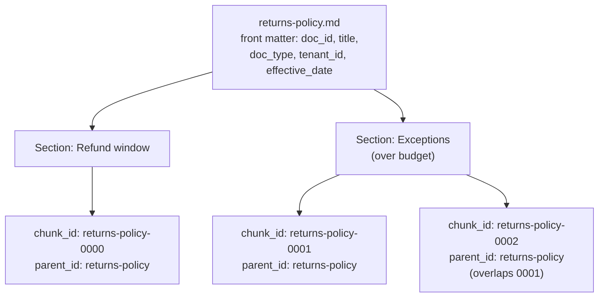

# One document, many search documents

Chunking changes the unit of storage: the index holds chunks, not documents.
`parent_id` is what still makes a document addressable as a set — which is what
the replacement strategy in [../rag-indexing.md](../rag-indexing.md) needs.

Every chunk carries the same `title`, `doc_type`, `tenant_id`, and `effective_date` copied
from the source document's front matter — the fan-out multiplies the number of search
documents, not the number of distinct metadata values. `c1` and `c2` come from the same
oversized section, split in two; their overlap is sentence-aligned and internal to that
section, never copied from `s1`'s chunk. See
[The overlap contract](../rag-indexing.md#the-overlap-contract).
