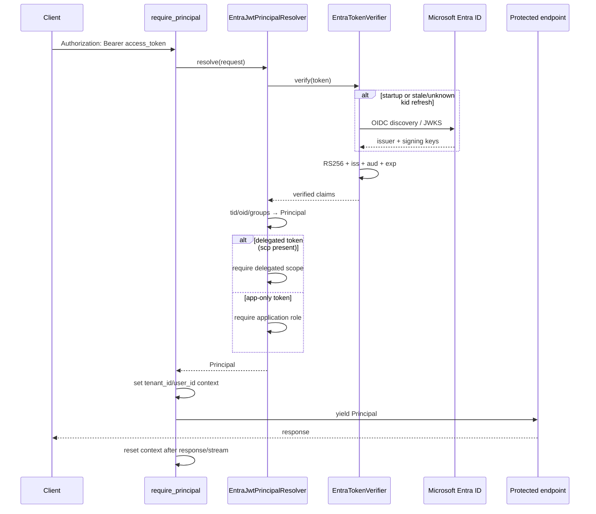

# Entra ID Authentication Sequence

Day 19. `AUTH_MODE=entra`: the caller presents a Microsoft Entra ID access token and
the backend verifies it itself. In `AUTH_MODE=headers` the same dependency runs, but
`HeaderPrincipalResolver` takes the place of `EntraJwtPrincipalResolver` and none of
the token machinery below exists — the mode is chosen once at startup, never per
request. Full contract in [entra-id-auth.md](../entra-id-auth.md).

## 401 — `unauthorized`

Returned with `WWW-Authenticate: Bearer` through the standard error envelope,
message `Missing or invalid credentials.` Every one of these lands here:

- No `Authorization` header, or more than one.
- The raw header value exceeds 16 KiB (checked **before** any splitting, on the
  value **including** the `Bearer ` prefix).
- Malformed credentials syntax — not exactly two single-space-separated parts, a
  scheme other than `bearer` (compared case-insensitively), or an empty token.
- `alg` is not `RS256`, or the header carries no usable `kid`.
- The `kid` is not in the published key set, even after a refresh.
- The signature, `iss`, `aud` or `exp` check fails, or `exp`/`iss`/`aud` is absent.
- `tid` or `oid` is missing, is not a string, or `tid` is not the configured tenant.
- A group overage signal is present — `hasgroups` present and **not exactly
  `False`** (`true`, `"true"`, `1` and `null` all count as the signal), or
  `_claim_names` carrying a `groups` entry. A `_claim_names` that is present but not
  a JSON object is also 401. The precise rule, and why the two claims read their
  nulls in opposite directions, is in
  [entra-id-auth.md §8](../entra-id-auth.md#8-groups-and-overage).
- The `groups` claim is present but is not an array of at most 100 strings.
- `Principal` construction fails Day 15's own validation.

The message never names which check failed: two resolvers share this dependency,
and telling an unauthenticated caller *which* one refused is free reconnaissance.
The detail goes to the server log, as an exception class name only.

## 403 — `insufficient_scope`

Returned with `WWW-Authenticate: Bearer error="insufficient_scope"`, message
`The credential lacks the required API permission.` The token was verified and the
caller is authenticated — the credential simply lacks the permission this API
requires:

- A delegated token (`scp` present) whose space-delimited scopes do not contain
  `ENTRA_REQUIRED_SCOPE`, or where that setting is unconfigured.
- An app-only token (`scp` absent) whose `roles` array does not contain
  `ENTRA_REQUIRED_APP_ROLE`, or where that setting is unconfigured.

Retrying with the same token is pointless, which is exactly what RFC 6750's
`insufficient_scope` challenge says. Identity is resolved *before* permissions, so
an untrusted `tid` or a group overage is 401 even when the scope would also have
been refused.

## Reading notes

- **On `/api/v1/chat/stream`, both rejections are pre-stream JSON** (the Day 6
  two-stage error boundary), never SSE `error` events: `require_principal` runs
  before the `StreamingResponse` is constructed.
- **Authorization denial is not on this diagram.** A document outside the caller's
  ACL is filtered at query time and is indistinguishable from one that does not
  exist — `/rag` answers `no_answer`, `/chat` answers `404 conversation_not_found`
  across tenants. Day 19 changes who the caller is, not that contract.
- **The refresh branch is opportunistic on a cache hit and blocking on a miss**, and
  a failed refresh retains the existing cache. See
  [entra-id-auth.md §9](../entra-id-auth.md#9-jwks-lifecycle) for the four residuals
  that follow from this.
