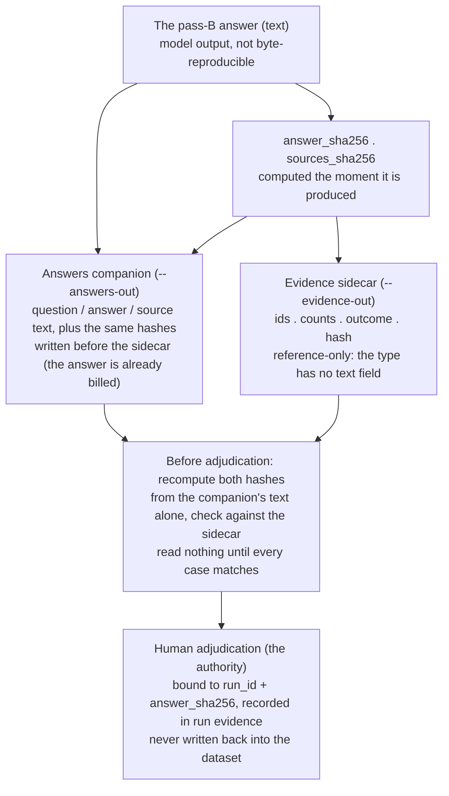

# The Adjudication Evidence Chain

Human adjudication of the judged layer needs the answer text, and the
reference-only evidence sidecar deliberately has no field for it. This
diagram shows the chain that makes adjudication both possible and
verifiable: the pass-B answer is hashed the moment it is produced; the
sidecar records ids, counts, outcomes, and those hashes; the opt-in
answers companion carries the readable text plus the same hashes and is
written first, because the answer is already billed. Before anyone reads
an answer, the two hashes are recomputed from the companion's text alone
and checked against the sidecar — proving the text being adjudicated is
the text that was judged. The human verdict is then recorded in the run's
evidence, bound to `run_id` and `answer_sha256`, never written back into
the dataset. See
[evaluation.md](../evaluation.md#8-human-feedback-the-authority-is-a-person-bound-to-one-run).

This English diagram is the semantic companion to the article's published
figure; `eval-evidence-chain.zh-tw.mmd` is the zh-TW publication source.
Keep the two in the same topology.

