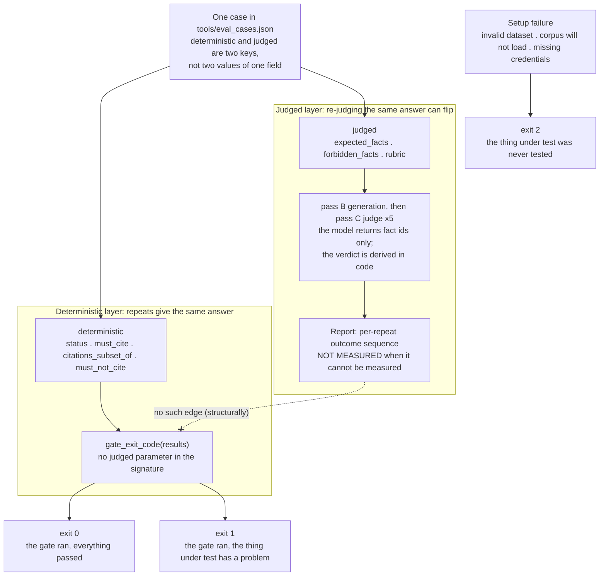

# Two Assertion Layers, One Exit Code

The Day 28 evaluation design splits every case's assertions across two
separate JSON keys — `deterministic` and `judged` — and gives only the
first a path to the process exit code. This diagram makes the missing
edge visible: judged-layer outcomes flow into the report, and the report
has no edge into `gate_exit_code`, whose signature takes only the
deterministic results map. The split is structural, not disciplinary — a
typo cannot promote a judged assertion into a gating one, and there is no
parameter through which a judged verdict could reach the gate. Setup
failures exit `2` before any verdict exists, so a run that never
evaluated the gate cannot look green. See
[evaluation.md](../evaluation.md#3-two-layers-and-only-one-of-them-owns-the-exit-code).

This English diagram is the semantic companion to the article's published
figure; `eval-two-layers.zh-tw.mmd` is the zh-TW publication source. Keep
the two in the same topology.

