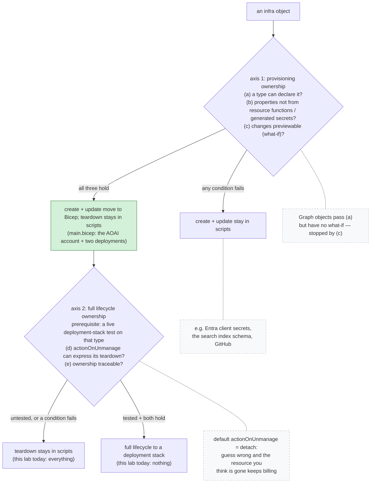

# Infrastructure Ownership Axes

Handing infrastructure to a template is two decisions, not one — this diagram
walks one object through both. Axis 1 (provisioning ownership) asks three
questions: a type can declare it, the properties you care about are not
resource functions or generated secrets, and changes are previewable with
`what-if`. Fail any and creation stays in scripts; pass all three and create +
update move to Bicep while teardown stays in scripts — where
[`main.bicep`](../../infra/bicep/main.bicep) sits today. Axis 2 (full lifecycle
ownership) only starts after a live deployment-stack test on that resource
type, and then asks whether `actionOnUnmanage` can express the teardown and
whether ownership is traceable. Nothing in this lab is across axis 2; the
conditions and the evidence behind each cell are in
[infra-evolution.md](../infra-evolution.md#the-two-axes). The side note on the
default matters most: `actionOnUnmanage` defaults to detach, so a wrong guess
does not break anything — the resource you think is gone keeps running and
keeps billing.

This English diagram is the semantic companion to the article's published
figure. The publication PNG is rendered from the localized source
[`infra-ownership-axes.zh-tw.mmd`](infra-ownership-axes.zh-tw.mmd) in this
same directory — both sources are public and canonical here; the planning repo
stores only the rendered PNG snapshot. Changes to either file must keep the
two topologies identical.

