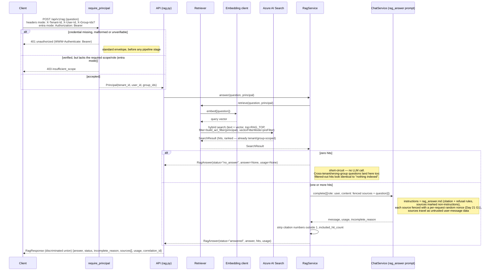

# RAG Query Sequence

Day 14 milestone, extended Day 15 and Day 19. `POST /api/v1/rag` — single-turn, `store=False`, no
conversation history and no token-budget ledger (that machinery is `/chat`-only, Day 7/Day 9).
Day 15 adds a mandatory `Principal`, resolved once before any pipeline stage runs and threaded into
every call that reaches the search index. Day 19 adds the second way to resolve it: a verified
Microsoft Entra ID access token, selected once at startup by `AUTH_MODE`. The JWT internals are not
duplicated here — see the [Entra authentication sequence](entra-auth-sequence.md) and
[entra-id-auth.md](../entra-id-auth.md).

One consequence worth carrying into this diagram: in Entra mode `tenant_id` and `group_ids` are
GUIDs, so an index built with the sample corpus's friendly names (`acme`, `oncall`) matches
nothing and every question lands in the zero-hits branch below. See
[entra-id-auth.md §8a](../entra-id-auth.md#8a-identity-namespaces-differ-between-modes--flipping-auth_mode-is-not-a-drop-in-change-for-rag).

## Reading notes

- **Principal is required, not optional, from the API boundary down to the
  search adapter.** `require_principal` runs before `RagService.answer()` is
  ever called; `RagService.answer`, `Retriever.retrieve`, and
  `SearchClient.search` all take `principal` as a required argument with no
  default, so there is no path through this diagram that reaches Azure AI
  Search without an authorization scope attached.
- **The ACL filter is server-built, never client-supplied.** `build_acl_filter(principal)`
  (`services/acl.py`) is the only source of the `filter` sent on the wire; a
  caller cannot widen, narrow, or replace it. `vectorFilterMode: preFilter`
  applies the filter before the ANN search picks its candidates, so a
  tenant's documents are never crowded out of the top-`k` by a shared
  index's other tenants — see
  [rag-retrieval.md](../rag-retrieval.md#access-control-is-a-query-time-filter-not-a-separate-check).
- **No authorization-denied signal.** A cross-tenant or wrong-group question
  reaches the same `status: "no_answer"` branch as a genuinely empty corpus —
  filtered-out hits are indistinguishable from hits that were never indexed.

- **No score threshold.** The zero-hits branch is the only structural no-answer
  gate. Day 13's live probe showed hybrid RRF scores cannot separate an
  answer-present corpus from an answer-absent one, so there is no cutoff to
  apply between "hits" and "answered" — grounding past that point is
  instructional (the prompt), not numeric.
- **Model refusal still returns `status: "answered"`.** If the LLM follows
  rule 3 of `rag_answer.md` and says the sources are insufficient, that is a
  successful generation from the pipeline's point of view — the honest gap is
  that a client cannot distinguish "grounded answer" from "polite refusal"
  by `status` alone; it has to read `answer` and the cited sources.
- **Sources are untrusted data, fenced, not instructions.** Retrieved chunks
  travel in the *user* message (`render_user_message`), each wrapped in
  start/end markers carrying a per-request random nonce (Day 21 G1), so
  poisoned corpus text cannot forge the closing marker; the *instructions*
  live only in the prompt template, which explicitly tells the model to
  treat source text as non-instructions. Fencing raises the bar; it is
  mitigation, not immunity — a poisoned corpus entry crafted to look like an
  instruction is still on the threat model, not closed by this design.
- **Citations are validated syntactically, not evidentially.** A `[n]` marker
  outside `1..included_hit_count` is stripped and logged by number only; a
  citation that survives points at a source that was really sent to the
  model, not proof that source supports the sentence it is attached to.
- **`usage` and `incomplete_reason` still apply per call** even though there is
  no conversation and no budget ledger — `LLM_MAX_OUTPUT_TOKENS` caps this
  single call exactly as it caps a `/chat` turn.
