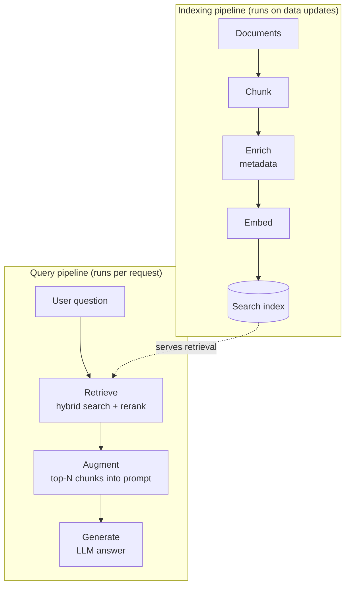

# RAG: Two Pipelines

The indexing pipeline runs when data changes; the query pipeline runs on every request. See [../rag-overview.md](../rag-overview.md) for why the split matters.

```mermaid
flowchart TB
    subgraph indexing["Indexing pipeline (runs on data updates)"]
        direction LR
        A[Documents] --> B[Chunk] --> C[Enrich<br/>metadata] --> D[Embed] --> E[(Search index)]
    end
    subgraph query["Query pipeline (runs per request)"]
        direction LR
        Q[User question] --> R[Retrieve<br/>hybrid search + rerank] --> G[Augment<br/>top-N chunks into prompt] --> L[Generate<br/>LLM answer]
    end
    E -.serves retrieval.-> R
```
