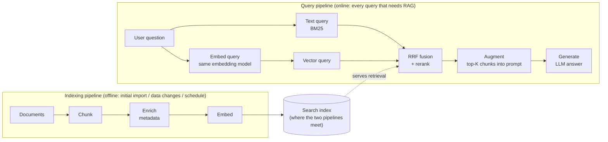

# RAG: Two Pipelines

The indexing pipeline is the offline/asynchronous path (triggered by initial import, data changes, or a schedule); the query pipeline is the online path for each request that requires retrieval augmentation. See [../rag-overview.md](../rag-overview.md) for why the split matters.

This English diagram is the semantic companion to the article's published figure. The publication PNG is rendered from a localized (zh-TW) Mermaid source tracked in the planning repo alongside the article assets; changes here must be mirrored there.

Layout note: the Search index is deliberately a shared node *between* the subgraphs (not inside the indexing container) so the `Search index → RRF fusion` edge renders node-to-node; Mermaid clips cross-subgraph edges at container borders when both endpoints live inside `direction LR` subgraphs.
