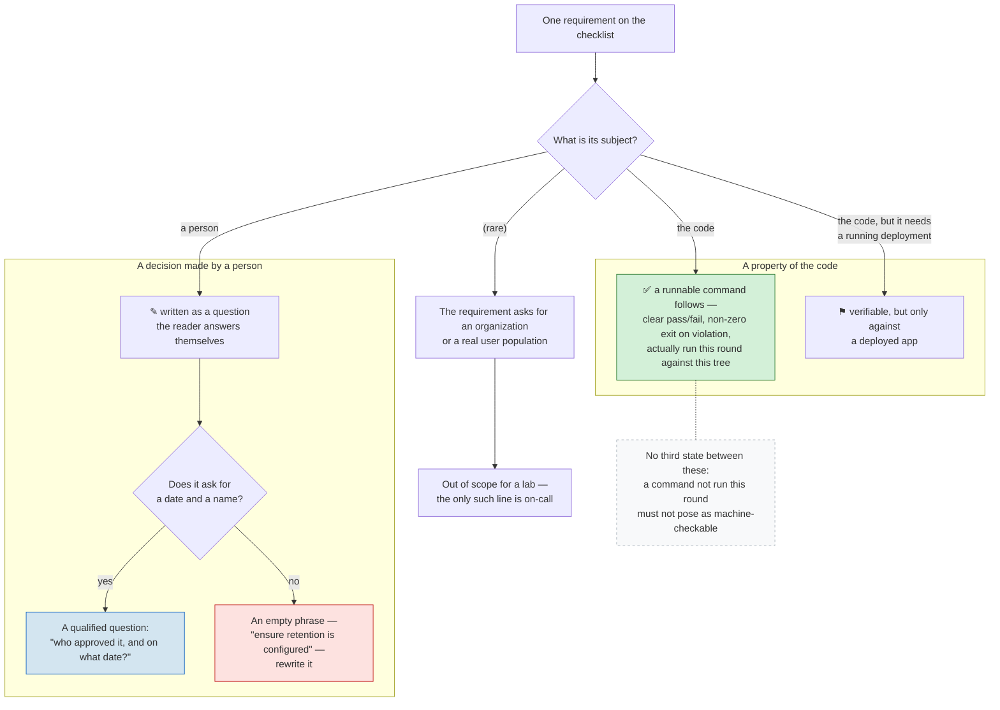

# The Checklist's Dividing Line

The Day 29 readiness checklist separates machine-checkable lines from
question lines without a `[verifiable]` tag: a line is machine-checkable
if and only if a runnable command follows it. This diagram shows where
that line actually runs — not between topics, but between requirements
whose subject is a **property of the code** and requirements whose
subject is a **decision made by a person**. Code-side lines carry a
command that was run against this tree (or are honestly marked as
verifiable only against a deployed app); person-side lines become
questions that must ask for a date and a name, because a question that
cannot be answered with either is an empty phrase wearing a
requirement's clothes. See
[production-readiness-checklist.md](../production-readiness-checklist.md#how-the-two-layers-are-separated).

This English diagram is the semantic companion to the article's published
figure; `readiness-dividing-line.zh-tw.mmd` is the zh-TW publication
source. Keep the two in the same topology.

