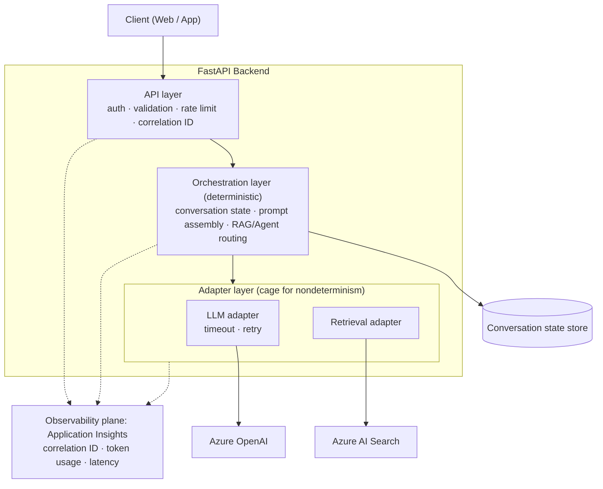

# Reference Architecture

High-level view of the lab's layers. Details and rationale in [architecture.md](../architecture.md).

```mermaid
flowchart TB
    Client["Client (Web / App)"]

    subgraph Backend["FastAPI Backend"]
        direction TB
        APIL["API layer<br/>auth · validation · rate limit · correlation ID"]
        Orch["Orchestration layer (deterministic)<br/>conversation state · prompt assembly · RAG/Agent routing"]
        subgraph Adapters["Adapter layer (cage for nondeterminism)"]
            direction LR
            LLMA["LLM adapter<br/>timeout · retry"]
            RetA["Retrieval adapter"]
        end
        APIL --> Orch --> Adapters
    end

    Client --> APIL
    LLMA --> AOAI["Azure OpenAI"]
    RetA --> Search["Azure AI Search"]
    Orch --> State[("Conversation state store")]

    Obs["Observability plane: Application Insights<br/>correlation ID · token usage · latency"]
    APIL -.-> Obs
    Orch -.-> Obs
    Adapters -.-> Obs
```

Solid arrows: runtime request flow. Dotted arrows: telemetry.
