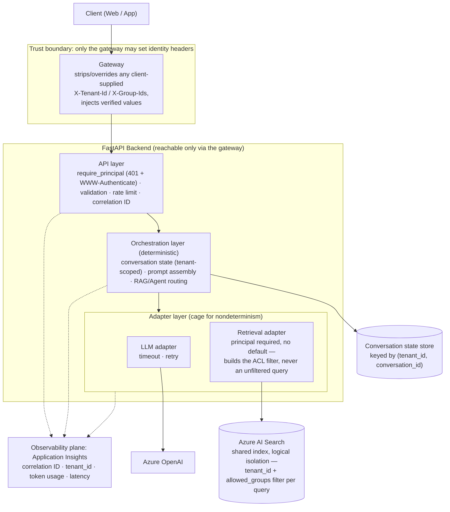

# Reference Architecture

High-level view of the lab's layers. Details and rationale in [architecture.md](../architecture.md).

Solid arrows: runtime request flow. Dotted arrows: telemetry.

**Trust boundary (Day 15).** `X-Tenant-Id`/`X-Group-Ids` are trusted-gateway input, not
end-user-verifiable credentials: only the gateway may set them, and the backend must be unreachable
except through it. Sent straight to the backend, these headers are impersonation knobs, not
authentication. Isolation inside Azure AI Search is **logical, not physical** — every tenant's
chunks share one index, and the ACL filter derived from the request's `Principal` is the only thing
that separates them; there is no "access denied" signal, only documents that are filtered out and
therefore indistinguishable from documents that were never indexed. See
[api-conventions.md](../api-conventions.md#identity-and-tenancy-day-15) for the full contract.
