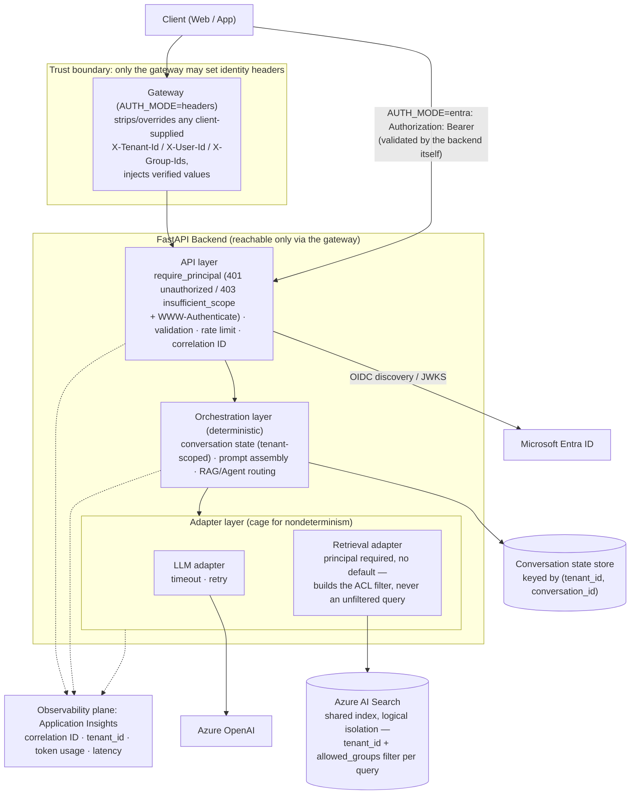

# Reference Architecture

High-level view of the lab's layers. Details and rationale in [architecture.md](../architecture.md).

Solid arrows: runtime request flow. Dotted arrows: telemetry.

**Trust boundary (Day 15, extended Day 19).** Two mutually exclusive identity sources sit behind
one dependency, chosen once at startup from `AUTH_MODE`.

In **headers mode**, `X-Tenant-Id`/`X-User-Id`/`X-Group-Ids` are trusted-gateway input, not
end-user-verifiable credentials: only the gateway may set them — it must strip or override all
three from any client-supplied request — and the backend must be unreachable except through it.
Sent straight to the backend, these headers are impersonation knobs, not authentication.

In **Entra mode** the backend validates a Microsoft Entra ID Bearer token itself, against the
signing keys it fetches from the configured tenant's OIDC metadata, and the `X-*` identity headers
are read by nothing. See [entra-id-auth.md](../entra-id-auth.md) and the
[authentication sequence](entra-auth-sequence.md).

Unchanged either way: isolation inside Azure AI Search is **logical, not physical** — every
tenant's chunks share one index, and the ACL filter derived from the request's `Principal` is the
only thing that separates them; there is no "access denied" signal, only documents that are
filtered out and therefore indistinguishable from documents that were never indexed. See
[api-conventions.md](../api-conventions.md#identity-and-tenancy) for the full contract.
