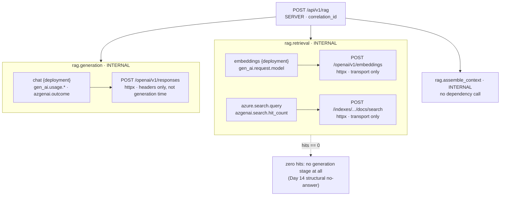

# One RAG Request's Span Tree

The `/rag` path is drawn because it is the only one of the three that has all
three shapes at once: application stage spans, two different kinds of
dependency underneath one of them, and two levels of nesting. See
[observability.md](../observability.md#the-span-tree) for the other two trees.

Two things this diagram exists to make unambiguous:

- `embeddings` and `azure.search.query` hang off `rag.retrieval`, not off the
  server span. "Embeddings took 300ms" reads differently depending on which is
  true, and a flat list of span names cannot tell them apart.
- Each application-owned span sits directly above an HTTP span that measures
  something narrower than it does. The httpx span ends when response headers
  return, not when the body is consumed — which is why it is drawn as a leaf
  and labelled transport, not latency.

This English diagram is the semantic companion to the article's published
figure; `request-lifecycle.zh-tw.mmd` is the zh-TW publication source. Keep the
two in the same topology.

