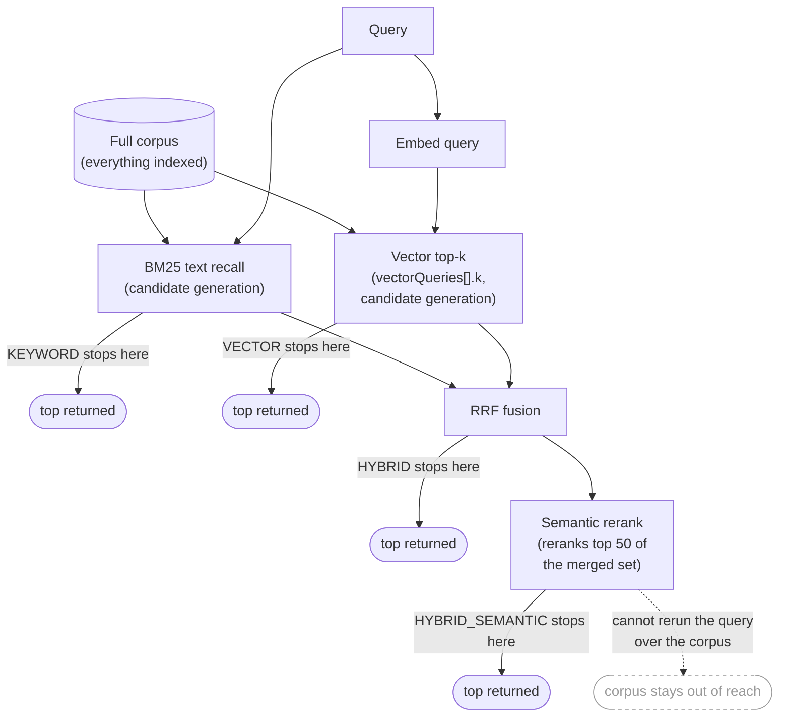

# Retrieval Stages

Companion diagram to [../rag-retrieval.md](../rag-retrieval.md): the same
three stages — candidate generation, fusion, ranking — drawn as one flow,
with each of the four modes marked by where it stops.

The dead-end edge out of the reranker is deliberate: the semantic ranker
"can't rerun the query over the entire corpus" — it only reorders whatever
candidate generation already produced. If the right chunk was never recalled
by BM25 or the vector query, no amount of reranking finds it; the fix is
`vector_k` or the text query, not `HYBRID_SEMANTIC`. See [Retrieval is three
stages that fail separately](../rag-retrieval.md#retrieval-is-three-stages-that-fail-separately).

`vector_k`, `top`, and the reranker's fixed 50 are three different numbers
that happen to share the same neighbourhood in this diagram: `vector_k`
bounds what the vector side offers into fusion, `top` bounds what any mode
finally returns, and 50 is a constant on the reranker's own input, independent
of both. See [`k`, `top` and 50 are three different
numbers](../rag-retrieval.md#k-top-and-50-are-three-different-numbers).
