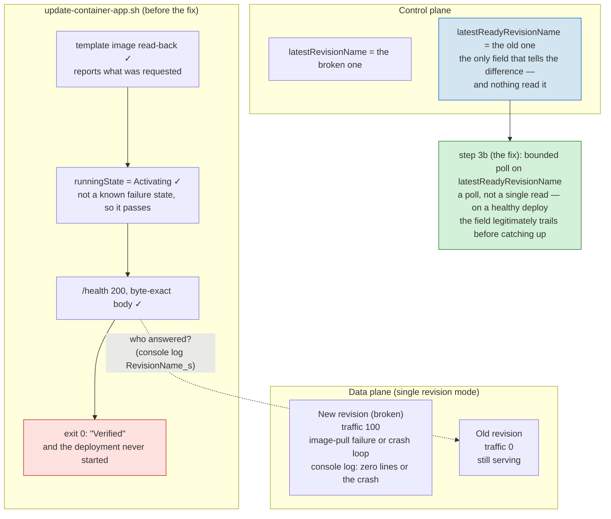

# Three Checks Pass, the Deployment Never Started

On 2026-08-24 two failure modes were injected into a single-revision-mode
Container App — an image reference whose digest does not exist, and an
image that pulls but dies during startup. Both times the deploy script's
three checks passed and it exited 0: the template read-back reports what
was requested, `Activating` is not a known failure state, and `/health`
returned the byte-exact body because the previous revision was still
serving. The control plane could tell the difference the whole time, in a
field nothing was reading: `latestReadyRevisionName` stayed on the old
revision while `latestRevisionName` pointed at the broken one — and
traffic weight is not the tell, it read 100 on the broken revision both
times. Step 3b now polls that field. See
[production-readiness-checklist.md](../production-readiness-checklist.md#rollback)
and [ci-cd.md §11](../ci-cd.md#11-what-the-live-session-settled-and-what-is-still-open).

This English diagram is the semantic companion to the article's published
figure; `revision-false-pass.zh-tw.mmd` is the zh-TW publication source.
Keep the two in the same topology.

