# Three Timings of One Streamed Call

One `/chat/stream` request produces three numbers that are routinely confused
for each other. This diagram exists to make their containment relationship
visible: the httpx transport span ends when response headers return at 1.067 s,
while generation continues until 2.568 s — so reading the transport span as
"how long the model took" under-reports this request by more than half. The gap
between the two bars is where the model was reasoning (64 reasoning tokens on
this call) with not a single content byte on the wire.

The measurements are one live call (gpt-5-mini, japaneast, 2026-08-21). A
second deployed measurement showed the same direction at a more extreme ratio
(transport span covering 11% of generation); the two are not a controlled
comparison, so only the direction is claimed. See
[observability.md](../observability.md#streaming).

The httpx bar is drawn in red because it is the trap, not because anything
failed: it is the number a dependency-latency chart would show you.

This English diagram is the semantic companion to the article's published
figure; `streaming-latency.zh-tw.mmd` is the zh-TW publication source. Keep the
two in the same topology.

```mermaid
gantt
    title Three timings of one /chat/stream call (gpt-5-mini, japaneast, 2026-08-21)
    dateFormat x
    axisFormat %S.%L s
    tickInterval 500millisecond
    section semantic span
        chat chat-mini (whole generation, 2.568 s) : active, 0, 2568
        first content chunk (TTFB 2.410 s)         : milestone, 2410, 0
    section httpx span
        request sent -> response headers (1.067 s)      : crit, 0, 1067
        headers back, no chunk yet (reasoning, 1.34 s)  : done, 1067, 2410
```

