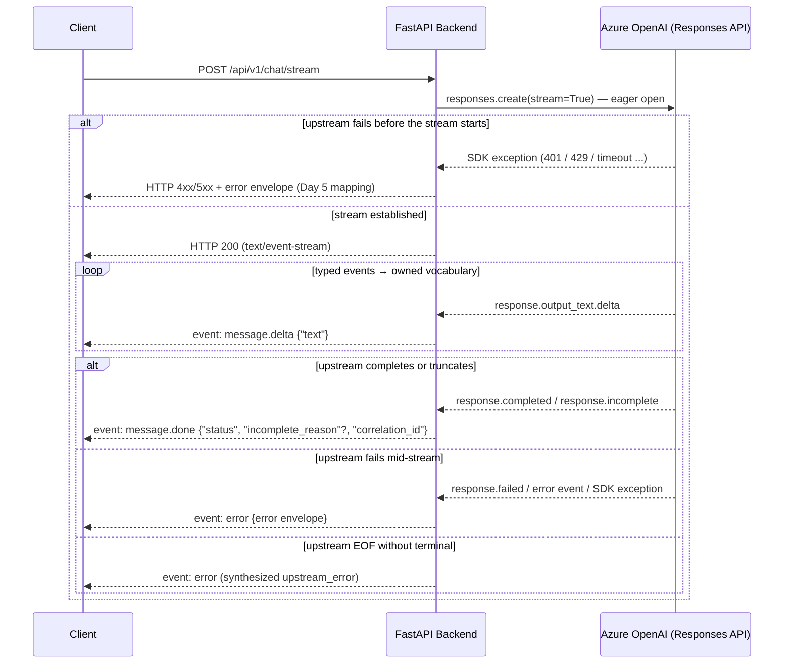

# Streaming Sequence

Two-phase error boundary: the upstream stream is opened eagerly, before any
byte reaches the client, so pre-stream failures keep their HTTP status codes.
After the 200, the serializer guarantees exactly one terminal event
(`message.done` or `error`) on a normally closed stream.

Terminal guarantee: when the client stays connected and the stream ends
normally, it receives exactly one terminal event; EOF without a terminal must
be treated as a failure. On client disconnect the adapter closes the upstream
stream in a `finally` block.

Conversation state (Day 7) wraps this flow without changing it: the
conversation is resolved before the eager open (an unknown `conversation_id`
is a pre-stream 404), the issued id travels in the `X-Conversation-Id`
response header (provisional on a first turn until a keepable terminal), and
the turn — transcript plus provider replay items — commits to the
`ConversationStore` just before the `message.done` terminal is delivered.
`error`, `content_filter`/`other`, and disconnects before the upstream
terminal is consumed commit nothing; a storage failure after the 200 becomes
an SSE `error` terminal with code `storage_error` (see
[Conversation Turn Lifecycle](../state-models/conversation-session-fsm.md)).
