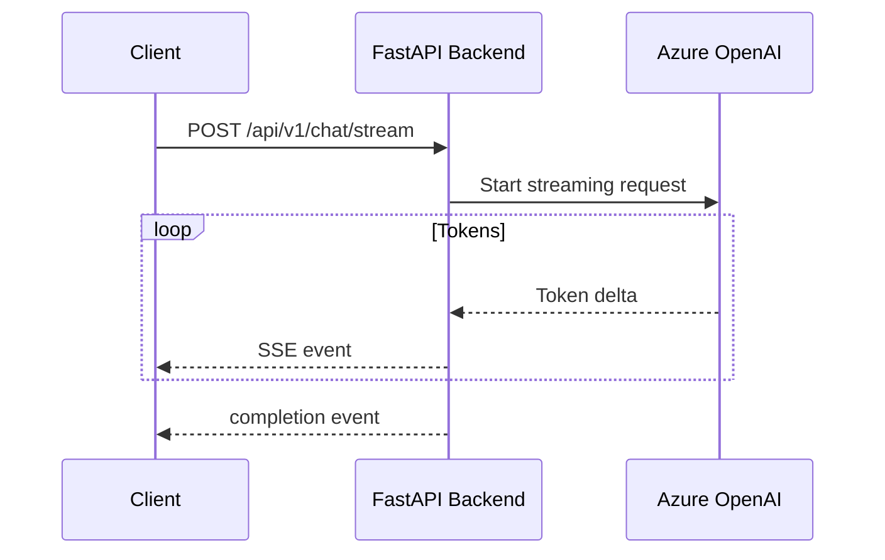

# Streaming Sequence

```mermaid
sequenceDiagram
    participant Client
    participant API as FastAPI Backend
    participant LLM as Azure OpenAI

    Client->>API: POST /api/v1/chat/stream
    API->>LLM: Start streaming request
    loop Tokens
        LLM-->>API: Token delta
        API-->>Client: SSE event
    end
    API-->>Client: completion event
```
