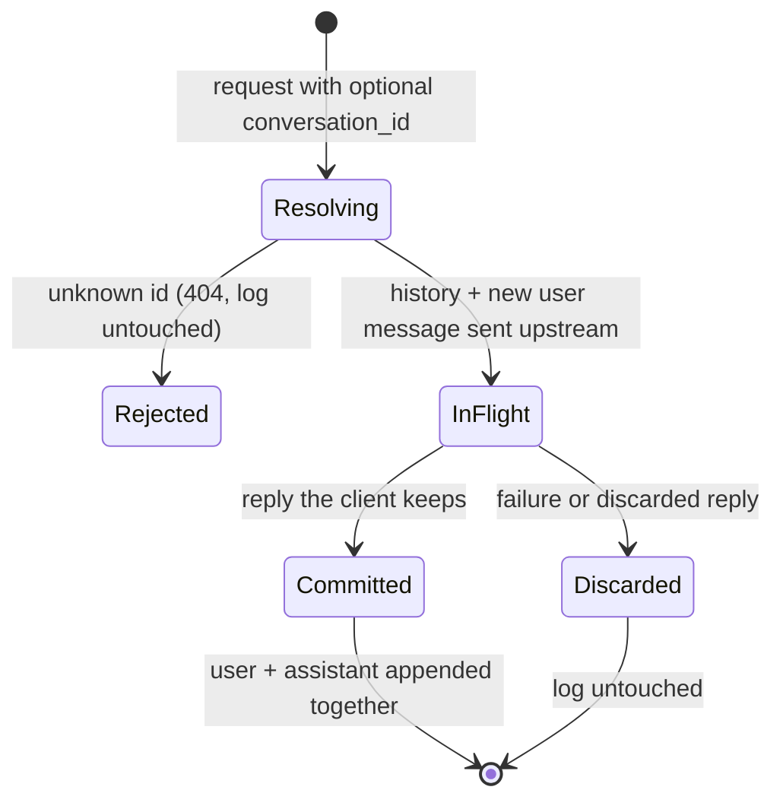

# Conversation Turn Lifecycle

A conversation is an append-only message log owned by the backend (`store=False` upstream — no server-side history exists on Azure's side). There is no session state machine to manage; the only stateful decision is whether a *turn* (user message + assistant reply) enters the log. That decision is atomic — turn-commit:

A reply "the client keeps" (per the Day 6 SSE contract): non-streaming success, stream `completed`, or stream `incomplete` with reason `max_output_tokens` (partial text committed — it is what the client saw). Everything else is `Discarded`: upstream errors, `content_filter` / `other` truncations (the client must discard the text, so the log must not keep it either), client disconnects mid-stream, and empty replies.

Because failed turns leave no trace, retrying a turn cannot duplicate or corrupt history, and a `conversation_id` issued on a failed first turn simply never comes into existence.

Enforced by `tests/unit/test_conversation_service.py` and `tests/bdd/features/conversation_state.feature`.
