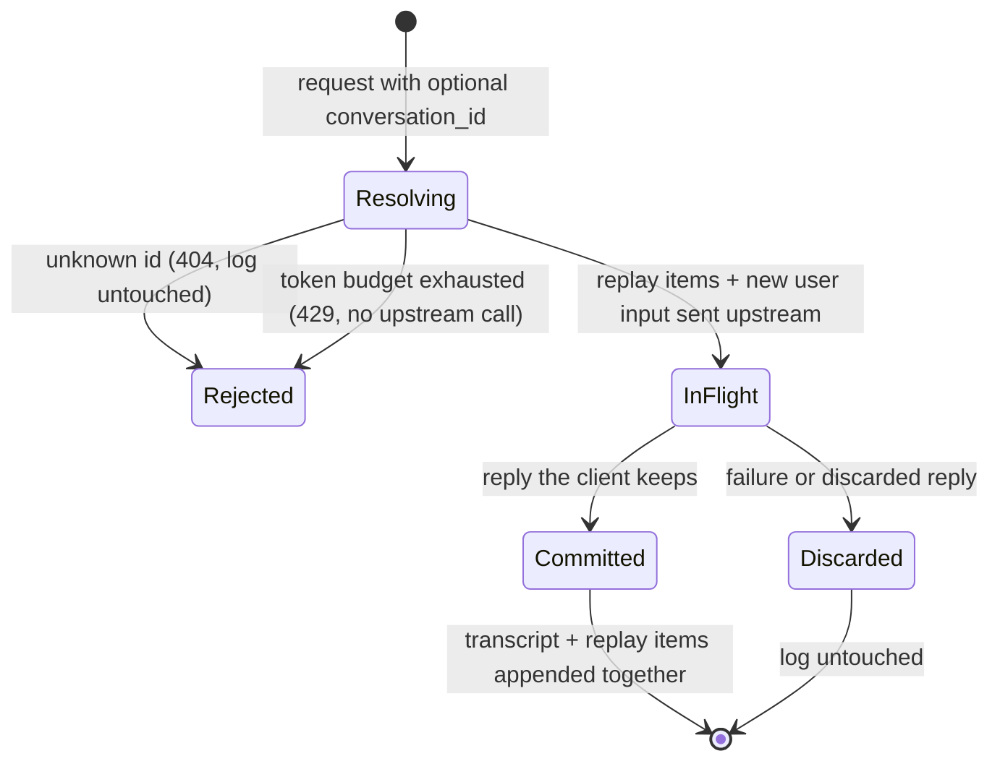

# Conversation Turn Lifecycle

A conversation is an append-only log owned by the backend (`store=False` upstream — no server-side history exists on Azure's side). There is no session state machine to manage; the only stateful decision is whether a *turn* enters the log. That decision is atomic — turn-commit — and each committed turn is stored at two fidelities: the visible transcript (user + assistant messages) and the provider replay items (user input item + all response output items, including encrypted reasoning items) that the next request resends verbatim.

A reply "the client keeps" (per the Day 6 vocabulary, which since Day 9 also governs non-streaming responses via `status`/`incomplete_reason`): `completed`, or `incomplete` with reason `max_output_tokens`, on either endpoint (partial text committed — it is what the client saw). Everything else is `Discarded`: upstream errors, `content_filter` / `other` truncations (the client must discard the text, so the log must not keep it either), and client disconnects **before the upstream terminal is consumed**. Once the terminal is consumed the commit stands whether or not `message.done` provably reached the client — no transport can prove delivery across a dying socket; the one-way invariant is that a client which received `message.done` can rely on the history existing. An empty non-streaming reply is mapped to `502 upstream_error` instead of committing (or issuing) anything.

Concurrency: read → inference → commit is one per-conversation critical section, so parallel turns on the same id cannot both build on a stale snapshot and record a causally false order. The commit itself is conditional — it presents the revision read at the start of the turn, and a stale revision is rejected (`ConversationConflictError`), which is the contract a multi-replica persistent adapter enforces natively. Storage failures surface as `storage_error` (HTTP 500 envelope, or SSE `error` after the 200); the store's `append` is required to be all-or-nothing (prepare-then-publish: anything that can fail happens before the first mutation).

Because failed turns leave no trace, retrying a turn cannot duplicate or corrupt history, and a `conversation_id` issued on a failed first turn simply never comes into existence (the streaming header id is provisional for exactly this reason).

Each committed turn also appends its provider-reported token usage to the conversation's ledger, in the same all-or-nothing `append` (Day 9). The ledger is what the `Resolving → Rejected` budget transition reads: the check runs before inference, so an exhausted conversation costs nothing further upstream. A failed turn may have incurred billable processing upstream but leaves no ledger trace — turn-commit semantics win over accounting completeness.

Enforced by `tests/unit/test_conversation_service.py` and `tests/bdd/features/conversation_state.feature`.
