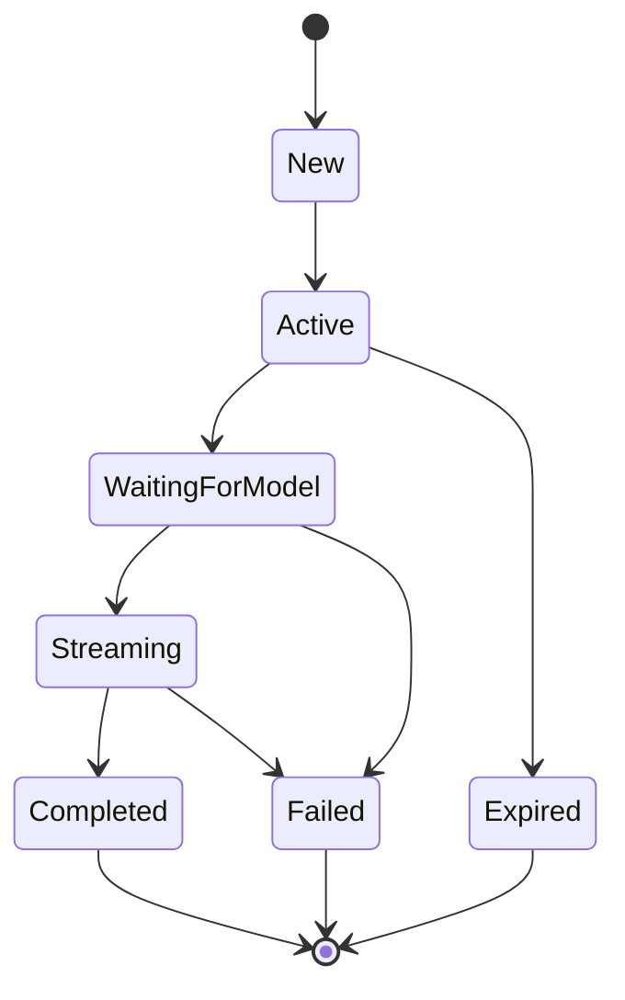

# Conversation Session FSM

```mermaid
stateDiagram-v2
    [*] --> New
    New --> Active
    Active --> WaitingForModel
    WaitingForModel --> Streaming
    Streaming --> Completed
    WaitingForModel --> Failed
    Streaming --> Failed
    Active --> Expired
    Completed --> [*]
    Failed --> [*]
    Expired --> [*]
```

This state model is a starting point and will evolve with the chat and streaming APIs.
