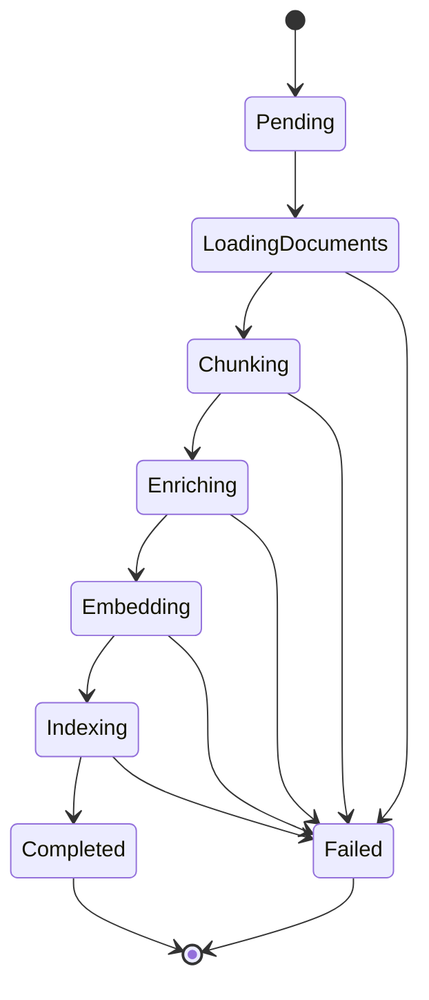

# RAG Indexing Job FSM

States follow the canonical indexing pipeline in [../rag-overview.md](../rag-overview.md): load → chunk → enrich → embed → persist. Enrichment is a distinct state because metadata failures are an independently observable failure boundary (bad metadata poisons filtering/ranking even when embeddings are fine).

