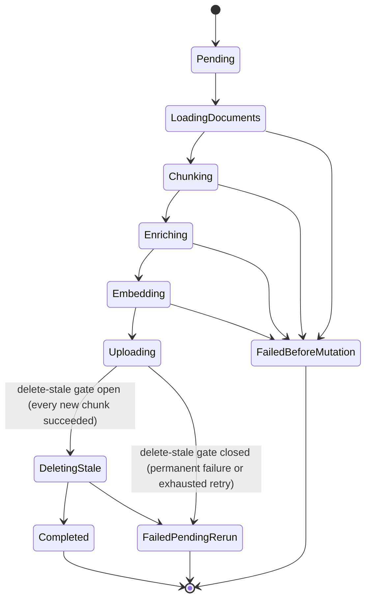

# RAG Indexing Job FSM

States follow the canonical indexing pipeline in [../rag-overview.md](../rag-overview.md): load → chunk → enrich → embed → persist. Enrichment is a distinct state because metadata failures are an independently observable failure boundary (bad metadata poisons filtering/ranking even when embeddings are fine). The persist state is split into `Uploading` and `DeletingStale` because they carry different failure semantics — see [../rag-indexing.md](../rag-indexing.md#failure-handling) for the full contract.

Failure is not one terminal state: a failure before any chunk has been written to the index (`LoadingDocuments` through `Embedding`) leaves the index completely untouched, while a failure during or after `Uploading` can leave old and new chunks both present, because the stale-chunk delete step never runs unless every new chunk succeeded first. The `Uploading → DeletingStale` transition is gated on `may_delete_stale()`: only when every expected chunk key came back exactly once, with no unexpected keys and no failures, does deletion of the superseded chunks proceed.

```mermaid
stateDiagram-v2
    [*] --> Pending
    Pending --> LoadingDocuments
    LoadingDocuments --> Chunking
    Chunking --> Enriching
    Enriching --> Embedding
    Embedding --> Uploading
    Uploading --> DeletingStale: delete-stale gate open (every new chunk succeeded)
    DeletingStale --> Completed
    LoadingDocuments --> FailedBeforeMutation
    Chunking --> FailedBeforeMutation
    Enriching --> FailedBeforeMutation
    Embedding --> FailedBeforeMutation
    Uploading --> FailedPendingRerun: delete-stale gate closed (permanent failure or exhausted retry)
    DeletingStale --> FailedPendingRerun
    Completed --> [*]
    FailedBeforeMutation --> [*]
    FailedPendingRerun --> [*]
```

`FailedBeforeMutation` is safe to retry from scratch: nothing about this document changed in the
index. `FailedPendingRerun` means the document is left with its old chunks and some or all of its
new chunks both present — recoverable, since upload is an upsert and delete-stale operates on a
set difference, but not yet in a clean state. Both failure states are re-runnable; neither leaves
the index without queryable content for the document in question.
