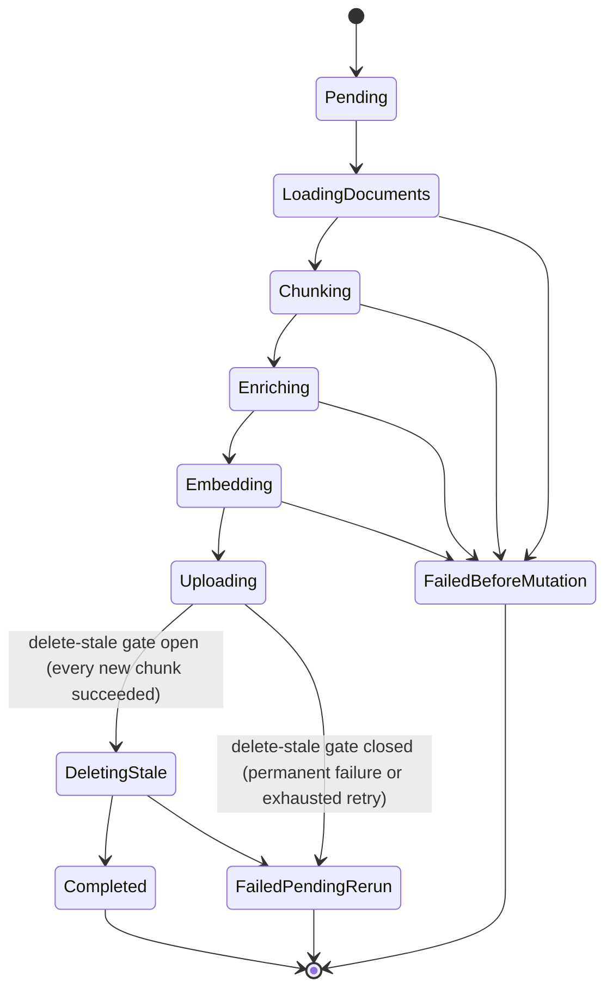

# RAG Indexing Job FSM

States follow the canonical indexing pipeline in [../rag-overview.md](../rag-overview.md): load → chunk → enrich → embed → persist. Enrichment is a distinct state because metadata failures are an independently observable failure boundary (bad metadata poisons filtering/ranking even when embeddings are fine). The persist state is split into `Uploading` and `DeletingStale` because they carry different failure semantics — see [../rag-indexing.md](../rag-indexing.md#failure-handling) for the full contract.

Failure is not one terminal state: a failure before any chunk has been written to the index (`LoadingDocuments` through `Embedding`) leaves the index completely untouched, while a failure during or after `Uploading` can leave old and new chunks both present, because the stale-chunk delete step never runs unless every new chunk succeeded first. The `Uploading → DeletingStale` transition is gated on `may_delete_stale()`: only when every expected chunk key came back exactly once, with no unexpected keys and no failures, does deletion of the superseded chunks proceed.

```mermaid
stateDiagram-v2
    [*] --> Pending
    Pending --> LoadingDocuments
    LoadingDocuments --> Chunking
    Chunking --> Enriching
    Enriching --> Embedding
    Embedding --> Uploading
    Uploading --> DeletingStale: delete-stale gate open (every new chunk succeeded)
    DeletingStale --> Completed
    LoadingDocuments --> FailedBeforeMutation
    Chunking --> FailedBeforeMutation
    Enriching --> FailedBeforeMutation
    Embedding --> FailedBeforeMutation
    Uploading --> FailedPendingRerun: delete-stale gate closed (permanent failure or exhausted retry)
    DeletingStale --> FailedPendingRerun
    Completed --> [*]
    FailedBeforeMutation --> [*]
    FailedPendingRerun --> [*]
```

`FailedBeforeMutation` is safe to retry from scratch: nothing about this document changed in the
index. `FailedPendingRerun` covers more than one shape of partial completion: an `Uploading` failure
where the request never landed leaves the old chunks intact and **zero** new chunks written — the
same index state `FailedBeforeMutation` describes, but routed to `FailedPendingRerun` anyway,
because a caller cannot reliably distinguish "the request never landed" from "the request landed
and only its response was lost," and treating an unconfirmed upload as if it were confirmed clean
would be the wrong side to fail on. An `Uploading` failure where the batch response came back
partial (a 207) leaves the old chunks intact plus whichever new chunks succeeded; and a
`DeletingStale` failure leaves every new chunk written alongside whichever old chunks the delete
step had not yet reached. All of these are re-runnable, since upload is an upsert and delete-stale
operates on a set difference — but none of them is yet in a clean state.

Both failure states are re-runnable, but only a document that already had chunks from a prior
successful run is guaranteed to keep serving queryable content while a re-run is pending. For a
document being indexed for the first time — no prior chunks — a `FailedPendingRerun` during
`Uploading` can leave that document with no queryable content at all: there are no old chunks to
fall back on, and the new chunks that failed are not indexed.
